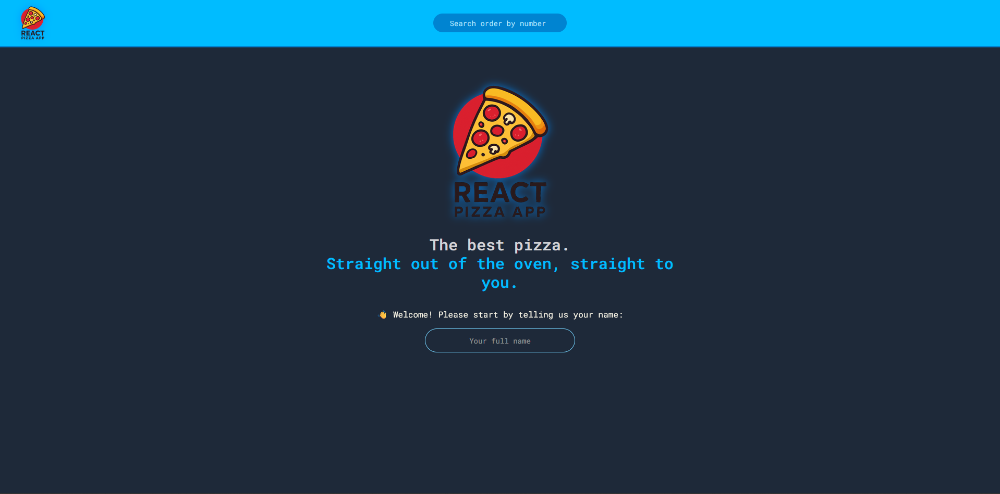
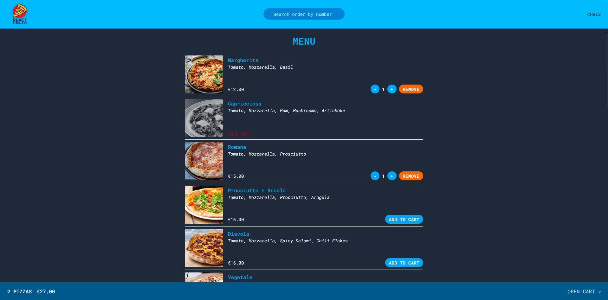
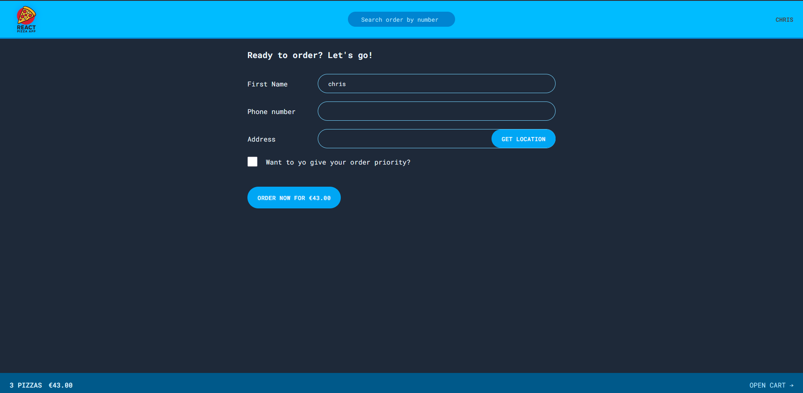
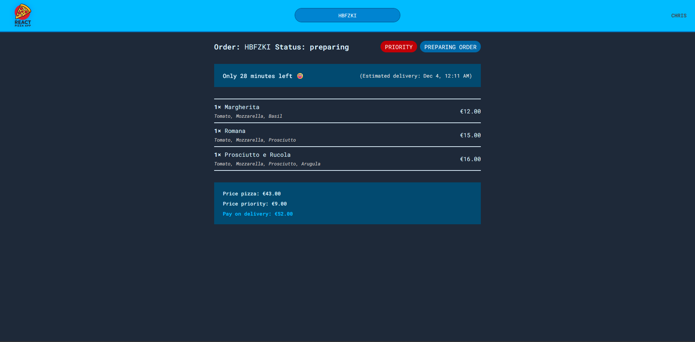

# 🍕 Pizza Ordering App (React + Redux Toolkit + React Router)

<div align="center" style="filter: drop-shadow(0 0 8px rgba(0, 140, 255, 0.8));">

</div>

> [!NOTE]
> This project was created by me while following Jonas Schmedtmann’s “The Ultimate React Course”.
> I built it independently, adapting the concepts from the course to deepen my understanding of React, Redux Toolkit, and React Router.

A fully featured pizza ordering SPA built with **React**, **Redux Toolkit**, and **React Router**.  
The app demonstrates a clean architecture for global state management (user & cart), form handling, async thunks, and interaction with API mocks.

---

## Table of Contents

1. [Technologies](#technologies)
2. [Functionality](#functionality)
   - [User](#user)
   - [Cart](#cart)
   - [Order](#order)
3. [Redux](#redux)
   - [User Slice](#user-slice)
   - [Cart Slice](#cart-slice)
4. [Order Handling](#order-handling)
5. [Geolocation (createAsyncThunk)](#geolocation-createasyncthunk)
6. [How the App Works](#how-the-app-works)
7. [Installation](#installation)
8. [Screenshots](#screenshots)
9. [TODO](#todo)

## Technologies

- **React**
- **Redux Toolkit (RTK)** – store, slices, selectors, async thunks
- **React Router**– loaders, actions, forms
- **Tailwind**- CSS
- **Custom API services** (mock REST endpoints)

---

# Functionality

### **User**

- Simple user registration
- Username stored in the Redux Store
- Automatic order form prefilling
- Address fetching through geolocation (createAsyncThunk)

### **Cart**

- Add pizzas to the cart
- Remove items
- Increase / decrease quantity
- Calculate total price and quantity
- Clear the cart
- Conditionally display UI based on cart state
- Pass cart data to the order form

### **Order**

- Order creation (React Router Action)
- Client-side form validation
- Phone number validation
- Dynamic pricing ("priority order" option)
- Redirect after successful order
- Automatic cart reset
- Search for existing orders by order ID
- Display full order details and estimated preparation time

---

# Redux

## User Slice

Stores:

- username
- geolocation loading status
- fetched address
- user coordinates

Includes createAsyncThunk that:

1. retrieves device geolocation
2. sends coordinates to a reverse-geocoding API
3. stores the resolved address in Redux

---

## Cart Slice

Manages:

- list of cart items

CRUD actions:

- addItem
- deleteItem
- increaseItemQuantity
- decreaseItemQuantity
- clearCart

Selectors:

- getTotalCartQuantity
- getTotalCartPrice
- getCurrentQuantityById (curried selector)

---

# Order Handling

The order form uses:

- Form from React Router
- action() for handling POST submission
- phone number validation
  -hidden input for cart data
- dynamic price calculation for priority orders

After submission:

- order is stored through createOrder
- cart is cleared
- user is redirected to /order/:id

---

# Geolocation (createAsyncThunk)

## `fetchAddress`

The `fetchAddress` async thunk retrieves the user’s current GPS coordinates using the browser’s Geolocation API and sends them to a reverse-geocoding service. It converts the returned data into a readable address string and returns both the coordinates and the formatted address. When fulfilled, the user slice stores this information and updates the order form automatically.

```js
export const fetchAddress = createAsyncThunk(
  "user/fetchAddress",
  async function () {
    const positionObj = await getPosition();
    const position = {
      latitude: positionObj.coords.latitude,
      longitude: positionObj.coords.longitude,
    };
    const addressObj = await getAddress(position);
    const address = `${addressObj.locality}, ${addressObj.city} ${addressObj.postcode}, ${addressObj.countryName}`;
    return { position, address };
  },
);
```

## Reverse Geocoding

```js
export async function getAddress({ latitude, longitude }) {
  const res = await fetch(
    `https://api.bigdatacloud.net/data/reverse-geocode-client?latitude=${latitude}&longitude=${longitude}`,
  );
  if (!res.ok) throw Error("Failed getting address");

  const data = await res.json();
  return data;
}
```

---

# How the App Works

- Open the Home page → enter a username
- Menu loads → pick pizzas
- Edit or remove items from the cart
- Proceed to checkout
- Form is prefilled using user & cart data
- Submit the order
- Cart resets
- Redirect to /order/:id
- **Users can search for an order by ID to view its details and estimated preparation time**

---

# Installation

```bash
npm install
npm run dev
```

---

# SCREENSHOTS

## HOME



## MENU



## NEW ORDER



## ORDER



---

# TODO

- Order history
- User authentication (OAuth)
- Payment integration (moc)
